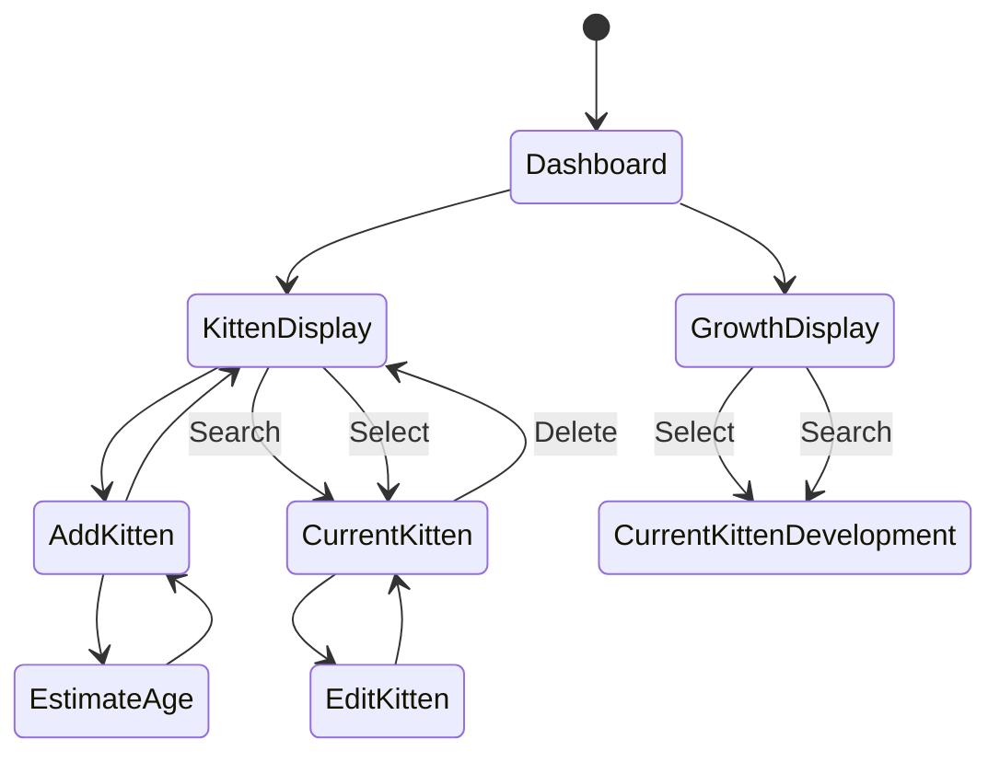
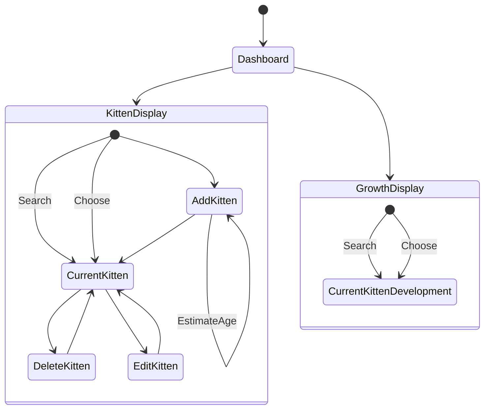
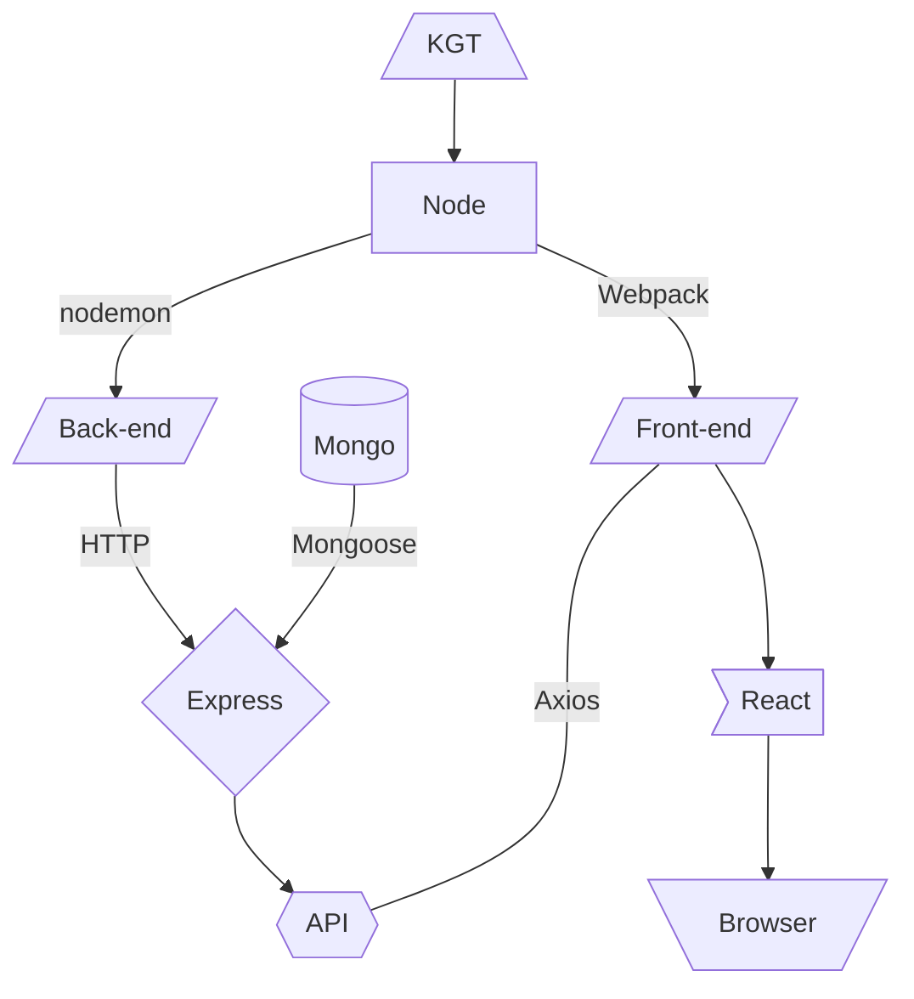
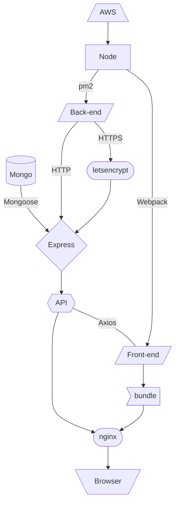

# Kitten Growth Tracker

A web app for calculating and managing the needs of growing kittens.

## Run this app locally

### Development mode

From the root directory:
First install all dependencies.
Open a terminal and run  `npm run install`.
Then, to start the back-end, run `npm run server`.
Leave that running in its own terminal and open another.
To start the front-end, run `npm run client`.
Leave this one running as well. Any changes you make will hot reload.

### Deployment mode

From the root directory:
First install all dependencies.
Open a terminal and run  `npm run install`.
Then run `npm run production`.
No need to leave any terminals open.
The server will be running in the background as a pm2 service. View its current status using `npm run server-status`. Restart the server at any time using `npm run restart-server`.
The front-end will be bundled into `front-end/dist` and served via http-server, which will print links to its location to the terminal. 

## Diagrams

### Components & Dependencies

### Code Structure
#### Development 

#### Production

## Applicable Standards
eslint and babel used to enforce:
- airbnb standard for javascript
- React recommended standards and rules for hooks
- jsx-a11y
- ES2021